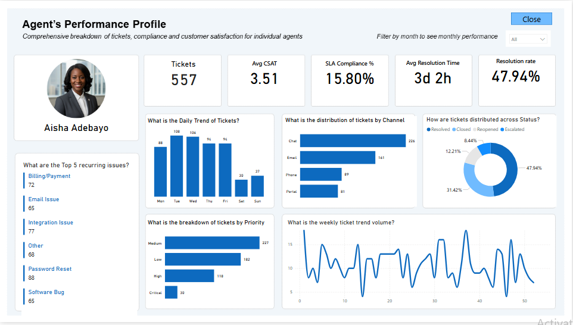
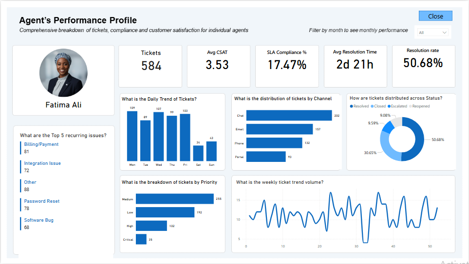
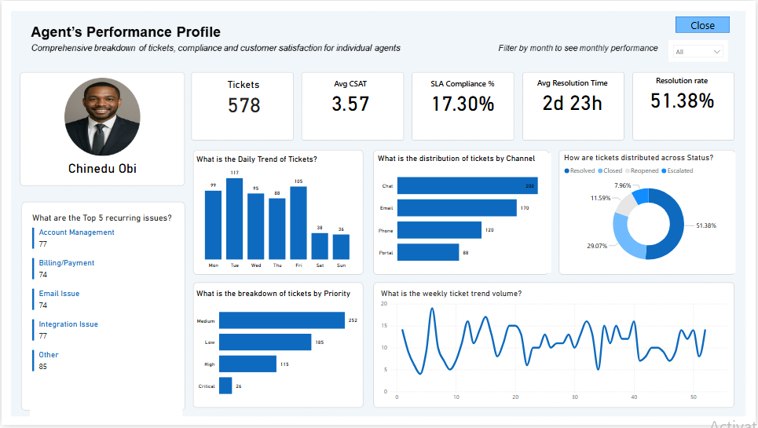
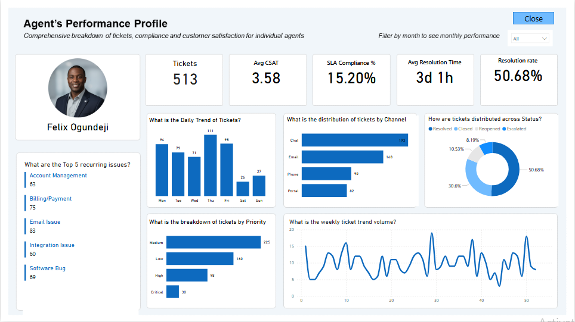
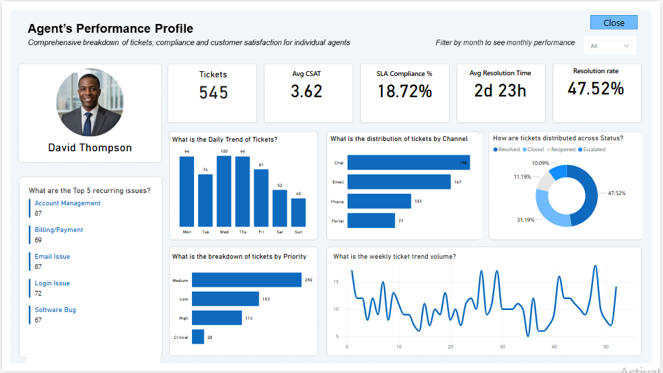
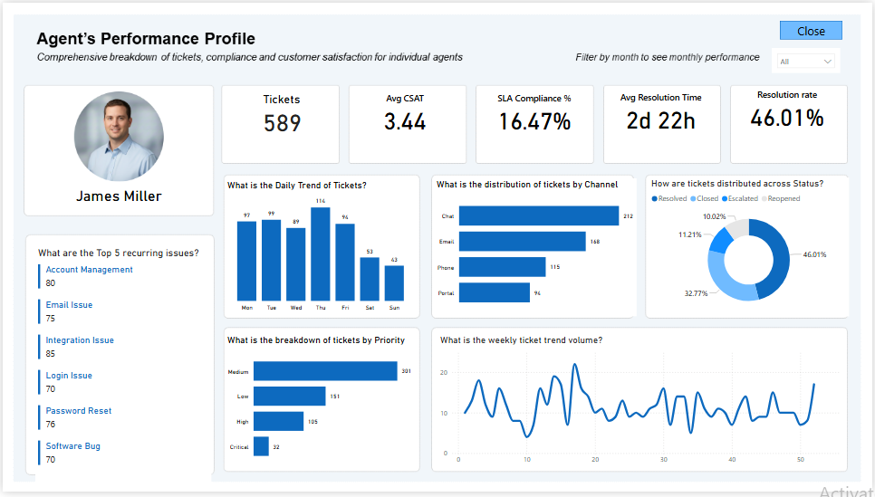

# Agent-performance-Dashboard-PowerBi-

This project focuses on building an **Agent Performance Dashboard** for an IT support environment using **Power BI**.

---

## 📑 Table of Contents
1. [Project Overview](#Project-Overview)  
2. [Business Problem](#Business-Problem)  
3. [Dataset & Data Model](#Dataset--Data-Model)  
4. [Dashboard & Key Metrics](#Dashboard--Key-Metrics)  
5. [Agent Performance Comparison Summary](#Agent-Performance-Comparison-Summary)  
6. [Key Insights](#Key-Insights)  
7. [Recommendations](#Recommendations)  
8. [Limitations](#Limitations)  

---

##  Project Overview

The dashboard provides a comprehensive view of agent performance across key operational and customer-centric metrics such as ticket handling efficiency, SLA compliance, and customer satisfaction.

It is designed to help stakeholders:
- Monitor agent productivity  
- Evaluate service quality  
- Identify performance gaps  
- Support data-driven decision-making  

---

## 🎯 Business Problem

Customer support teams often face challenges such as:
- Uneven workload distribution among agents  
- Low visibility into individual performance  
- Missed SLA targets  
- Difficulty tracking customer satisfaction trends  

Without a centralized analytical system, it becomes difficult to identify:
- Top-performing agents  
- Performance gaps  
- Recurring operational issues  

This project transforms raw ticket and feedback data into actionable insights.

---

## 🗂️ Dataset & Data Model

The dataset is structured using a **star schema** consisting of four tables:

**Fact Table**
- **Ticket Table**  
  Contains all support requests and serves as the core dataset.

**Dimension Tables**
- **Agent Table** → Agent details (ID, Name, Role, Image)  
- **Feedback Table** → Customer satisfaction (CSAT, comments)  
- **Date Table** → Enables time-based analysis  

**Model Design**
- One-to-many relationships from dimensions to the Ticket table  
- A dedicated **Measures Table** for DAX calculations  
- Optimized for scalability and clean reporting  

---

## 📊 Dashboard & Key Metrics

The dashboard presents both **individual agent profiles** and **overall performance trends**.

  
  
  

**Key KPIs**
- Total Tickets Handled  
- SLA Compliance (%)  
- Average Resolution Time  
- Resolution Rate  
- Average CSAT Score  

 **Dashboard Features**
- Agent-level performance breakdown  
- Ticket distribution by channel and issue type  
- Priority-based ticket analysis  
- Time-based trends  

---

## 📈 Agent Performance Comparison Summary

| Agent Name       | Tickets Handled | Avg CSAT | SLA Compliance | Avg Resolution Time | Resolution Rate |
|------------------|----------------|----------|----------------|---------------------|-----------------|
| Aisha Adebayo    | 557            | 3.51     | 15.80%         | 3d 2h               | 47.94%          |
| Chinedu Obi      | 578            | 3.57     | 17.30%         | 2d 23h              | 51.38%          |
| David Thompson   | 545            | 3.62     | 18.72%         | 2d 23h              | 47.52%          |
| Fatima Ali       | 584            | 3.53     | 17.47%         | 2d 21h              | 50.68%          |
| Felix Ogundeji   | 513            | 3.58     | 15.20%         | 3d 1h               | 50.68%          |
| James Miller     | 589            | 3.44     | 16.47%         | 2d 22h              | 46.01%          |

---

## 🔍 Key Insights

**1. High Workload Impacts Service Quality**

Agents handling the highest number of tickets do not necessarily deliver the best outcomes.  
**James Miller**, despite handling the most tickets, records the lowest CSAT and resolution rate.

**Insight:**  
High workload may negatively impact service quality.

---

**2. Balanced Performance is Key**

**Chinedu Obi** and **David Thompson** demonstrate strong all-round performance:
- Good ticket volume  
- High SLA compliance  
- Strong CSAT  

**Insight:**  
Balanced agents serve as ideal performance benchmarks.

---

**3. Faster Resolution Improves Customer Satisfaction**

Agents with faster resolution times tend to achieve higher CSAT scores.

**Insight:**  
There is a direct relationship between resolution speed and customer satisfaction.

---

**4. Low SLA Compliance Across All Agents**

SLA compliance ranges between 15%–19% across all agents.

**Insight:**  
This indicates a system-wide issue rather than individual underperformance.

---

**5. Top Performer Identified**

David Thompson stands out with:
- Highest CSAT  
- Highest SLA compliance  
- Strong overall balance  

**Insight:**  
Represents the most efficient and customer-focused agent.

---

**6. Efficiency vs Volume Trade-off**

A clear pattern exists:
- Higher ticket volume → lower quality metrics  
- Lower ticket volume → better efficiency  

**Insight:**  
Workload distribution needs optimization.

---

## 💡 Recommendations

- **Redistribute Workload**  

Balance ticket assignments across agents  

- **Set Performance Benchmarks**  
  Use top performers as standards  

- **Improve SLA Processes**  
  Review SLA targets and workflows  

- **Targeted Training**  
  Support underperforming agents  

- **Address Recurring Issues**  
  Reduce ticket volume through root cause analysis  

---

## ⚠️ Limitations & Future Improvements

 **Limitations**
- Limited number of agents  
- CSAT depends on customer participation  
- No real-time data integration  
---

## About me 

